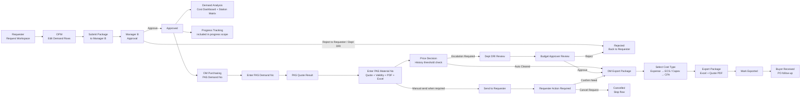
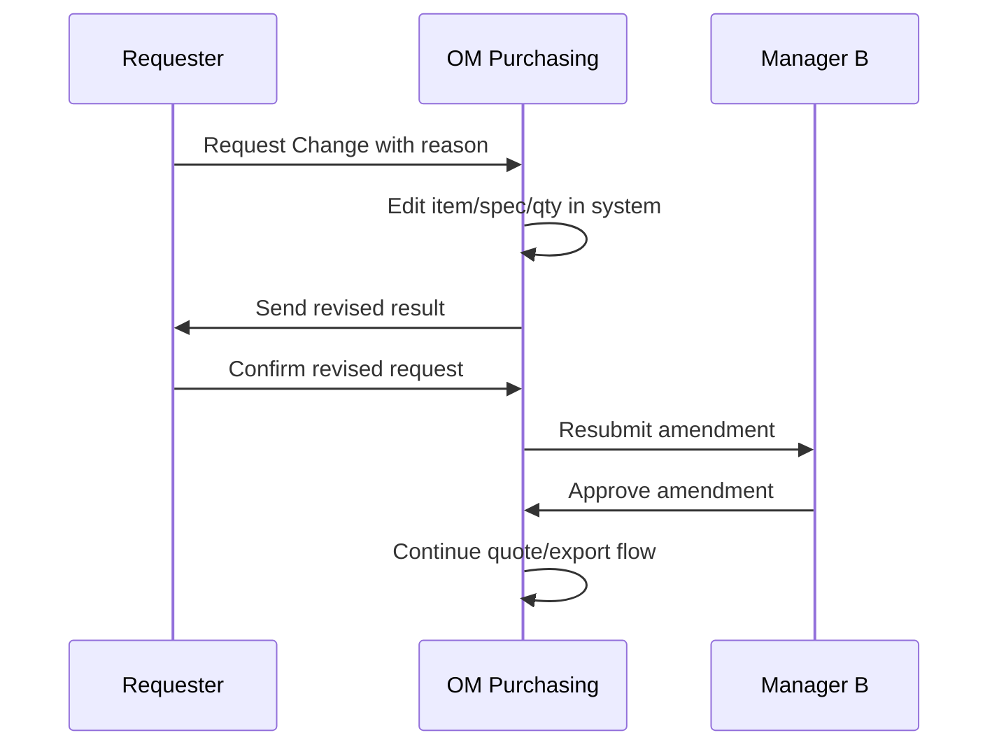

# 05 跨角色流程

## 主流程

## 狀態轉移

| From | Action | To | Owner |
| --- | --- | --- | --- |
| Draft | Submit Package to Manager B | Submitted | OPM |
| Submitted | Approve | Approved | Manager B |
| Submitted | Reject to Requester / Dept DRI | Rejected | Manager B |
| Approved | Route OM scope | Waiting PAS Demand No | System / OM |
| Waiting PAS Demand No | Move to PAS Quote Result | PAS Quote Result Needed | OM |
| PAS Quote Result Needed | Save Quote Info within threshold | Auto Cleared | OM/System |
| PAS Quote Result Needed | Save Quote Info over threshold / no history / temporary budget | Price Escalation Required | OM/System |
| Price Escalation Required | Dept DRI Approve | Waiting Budget Approver | DRI |
| Waiting Budget Approver | Budget Approver Approve | Budget Approver Approved | Budget Approver |
| Budget Approver Approved | Release | Export Package | System / OM |
| Auto Cleared | Release | Export Package | System / OM |
| PAS Quote Result Needed | Send to Requester when confirmation is required | Waiting Requester Confirmation | OM |
| Waiting Requester Confirmation | Confirm Need | Requester Confirmed | OPM |
| Waiting Requester Confirmation | Cancel Request | Cancelled by Requester | OPM |
| Requester Confirmed | Expense | Ready for ECS | OM |
| Requester Confirmed | Capex | Ready for CFA | OM |
| Ready for CFA/ECS | Export Package | Package Ready | OM |
| Package Ready | Mark Exported | Exported to CFA/ECS | OM |
| Exported to CFA/ECS | Buyer receive | Buyer Received | Buyer/System |

## 即時可見規則

- OPM submit 後：
  - `Approval > Pending Approval` 可見。
  - `Demand Analysis` 立即可見。
- Manager approve 後：
  - row 離開 `Pending Approval`。
  - `Approval > Approval History` 可見。
  - `Progress Tracking` 仍彙總。
  - `Demand Analysis` 仍顯示。
  - OM scope row 進 OM queue。
- OM send to Requester 後：
  - row 在 `PAS Quote Result` 變 readonly waiting state。
  - Requester `Action Required` 可見。
- OM save quote info 後：
  - quote 在門檻內時，row 變 `Auto Cleared`，不需 Requester confirmation，可進 `Export Package`。
  - 無 history price、temporary budget 或超過門檻時，row 進 `Dept DRI -> Budget Approver` price review。
- Requester confirm 後：
  - row 進 OM `Export Package`。
- OM mark exported 後：
  - Buyer downstream 可見。

## Reject / Cancel 規則

- `Reject to Requester / Dept DRI` 必填 reason。
- `Cancel Request` 必填 reason。
- Rejected / Cancelled 不進 Quantity Matrix active scope。
- Rejected / Cancelled 保留在 timeline/detail。

## Amendment Flow

已報價後修改流程：

規則：

- Requester 發起 change request。
- OM 代改 item/spec/qty。
- Requester 確認 revised result。
- 只要 item/spec/qty 有變，必須回 Manager B 重審。
- Previous quote 保留為 reference，不直接當新版 active quote。

## Carryover Flow

- Requester 可在輸入 demand 時宣告 `Request Line`、`Carryover From`、`Carryover Qty`、`Carryover Reason`。
- 系統寫入 ledger event，不覆蓋 original demand。
- Dept DRI 負責正式 carryover review。
- Manager B 看 Original / Saving / Effective cost 與 quantity。
- OM Export Package 消費 effective qty，不操作 carryover。

## Currency Rule

- 成本/價格計算以 USD canonical 欄位為準。
- VND 顯示、輸入與 export 透過 OM Leader 維護的每月 USD-to-VND 匯率換算。
