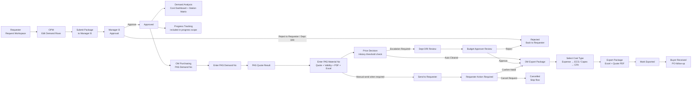
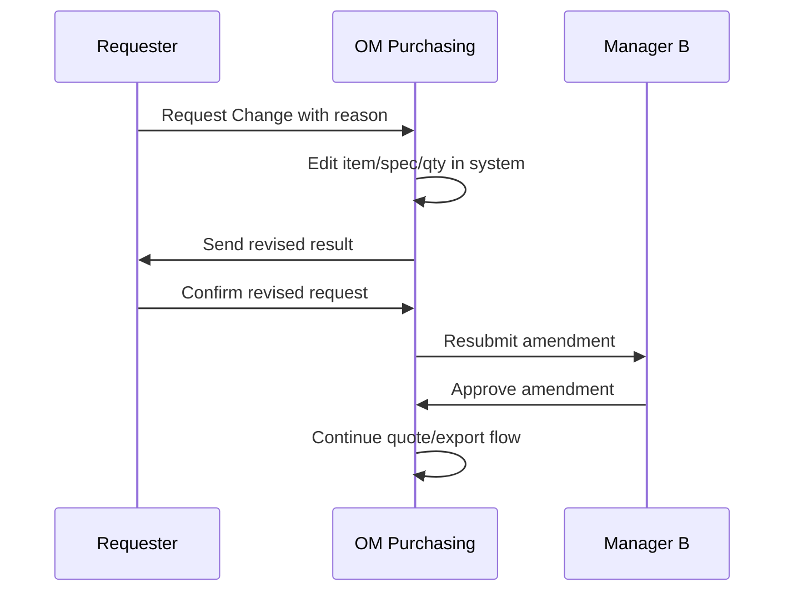

# 05 Cross-Role Flow

## Main Flow

## State Transition

| From | Action | To | Owner |
| --- | --- | --- | --- |
| Draft | Submit Package to Manager B | Submitted | OPM |
| Submitted | Approve | Approved | Manager B |
| Submitted | Reject to Requester / Dept DRI | Rejected | Manager B |
| Approved | Route OM scope | Waiting PAS Demand No | System / OM |
| Waiting PAS Demand No | Move to PAS Quote Result | PAS Quote Result Needed | OM |
| PAS Quote Result Needed | Save Quote Info within threshold | Auto Cleared | OM/System |
| PAS Quote Result Needed | Save Quote Info over threshold / no history / temporary budget | Price Escalation Required | OM/System |
| Price Escalation Required | Dept DRI Approve | Waiting Budget Approver | DRI |
| Waiting Budget Approver | Budget Approver Approve | Budget Approver Approved | Budget Approver |
| Budget Approver Approved | Release | Export Package | System / OM |
| Auto Cleared | Release | Export Package | System / OM |
| PAS Quote Result Needed | Send to Requester when confirmation is required | Waiting Requester Confirmation | OM |
| Waiting Requester Confirmation | Confirm Need | Requester Confirmed | OPM |
| Waiting Requester Confirmation | Cancel Request | Cancelled by Requester | OPM |
| Requester Confirmed | Expense | Ready for ECS | OM |
| Requester Confirmed | Capex | Ready for CFA | OM |
| Ready for CFA/ECS | Export Package | Package Ready | OM |
| Package Ready | Mark Exported | Exported to CFA/ECS | OM |
| Exported to CFA/ECS | Buyer receive | Buyer Received | Buyer/System |

## Visibility Rules

- After OPM submit:
  - Visible in `Approval > Pending Approval`.
  - Immediately visible in `Demand Analysis`.
- After Manager approve:
  - Row leaves `Pending Approval`.
  - Visible in `Approval > Approval History`.
  - Still aggregated in `Progress Tracking`.
  - Still shown in `Demand Analysis`.
  - OM scope rows enter OM queue.
- After OM sends to Requester:
  - Row remains in `PAS Quote Result` as readonly waiting state.
  - Requester `Action Required` can see it.
- After OM saves quote info:
  - If quote is within threshold, row is `Auto Cleared` and can enter `Export Package` without Requester confirmation.
  - If quote is missing history, temporary budget, or over threshold, row enters `Dept DRI -> Budget Approver` price review.
- After Requester confirms:
  - Row enters OM `Export Package`.
- After OM marks exported:
  - Buyer downstream can see it.

## Reject / Cancel Rules

- `Reject to Requester / Dept DRI` requires reason.
- `Cancel Request` requires reason.
- Rejected / Cancelled rows are excluded from active Quantity Matrix scope.
- Rejected / Cancelled rows stay in timeline/detail.

## Amendment Flow

Post-quote amendment flow:

Rules:

- Requester initiates change request.
- OM edits item/spec/qty.
- Requester confirms revised result.
- Any item/spec/qty change must return to Manager B approval.
- Previous quote is retained as reference and must not automatically become the new active quote.

## Carryover Flow

- Requester can declare `Request Line`, `Carryover From`, `Carryover Qty`, and `Carryover Reason` while entering demand.
- The system writes a ledger event instead of overwriting original demand.
- Dept DRI owns formal carryover review.
- Manager B sees Original / Saving / Effective cost and quantity.
- OM consumes effective quantity in Export Package; it does not operate carryover.

## Currency Rule

- Cost/price calculation uses USD canonical fields.
- VND display/export/input values are converted through the monthly USD-to-VND exchange rate maintained by OM Leader.
