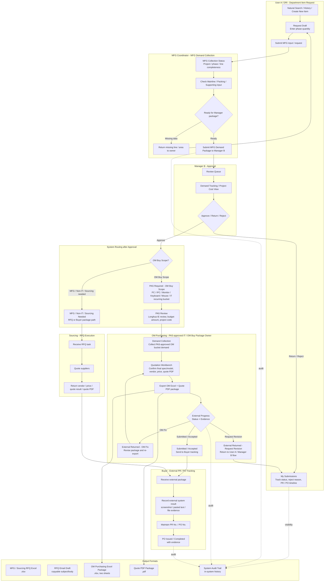

# Current System Flowchart

This flowchart describes the currently implemented procurement prototype after the role-model correction.

Important role rule:

- `Purchasing` is not a separate login role.
- `OM Purchasing` handles IT / OM Buy PAS Review, PAS-approved demand collection, and OM-side sourcing work.
- `MFG Coordinator` handles MFG line / phase demand collection and package readiness.
- `Sourcing` performs supplier quotation for RFQs when needed.
- `Buyer` tracks external system request no., PR No., PO No., status, and evidence. The prototype does not decide CFA vs ECS.

## Mermaid Flowchart

## Role Differences

| Role | Main Responsibility | Typical Output / Action |
| --- | --- | --- |
| OM Purchasing | PAS-approved IT / OM Buy demand collection, final spec/model confirmation, quotation, quote PDF, OM Excel package. | OM Excel `.xlsx`, quote PDF `.pdf`, package result, Buyer handoff. |
| MFG Coordinator | MFG line / phase demand collection, completeness check, package readiness for Manager B. | MFG Demand Package, collection status, missing line / area follow-up. |
| Sourcing | Supplier quotation for RFQ tasks when needed. | Vendor, price, quote result, quote PDF. |
| Buyer | Tracks external system result and PR / PO completion. | External request no., PR No., PO No., evidence, completion status. |

## Output File Formats

| Output | Owner | Format | Purpose |
| --- | --- | --- | --- |
| RFQ Excel | MFG / Sourcing flow | `.xlsx` | Split by Sourcing Owner for supplier quotation when needed. |
| RFQ Email Draft | MFG / Sourcing flow | Copyable subject/body | Used to send RFQ package outside the prototype. |
| OM Purchasing Excel Package | OM Purchasing | `.xlsx` | Formal OM package with `Project budget-summary table` and detail sheet. |
| Quote PDF Package | OM Purchasing / Sourcing | `.pdf` | Quote evidence attached to package or RFQ result. |
| Activity / History Records | System | In-system audit trail | Tracks RFQ dispatch, Sourcing reply, OM package, external progress evidence, Buyer PR / PO, and revisions. |
