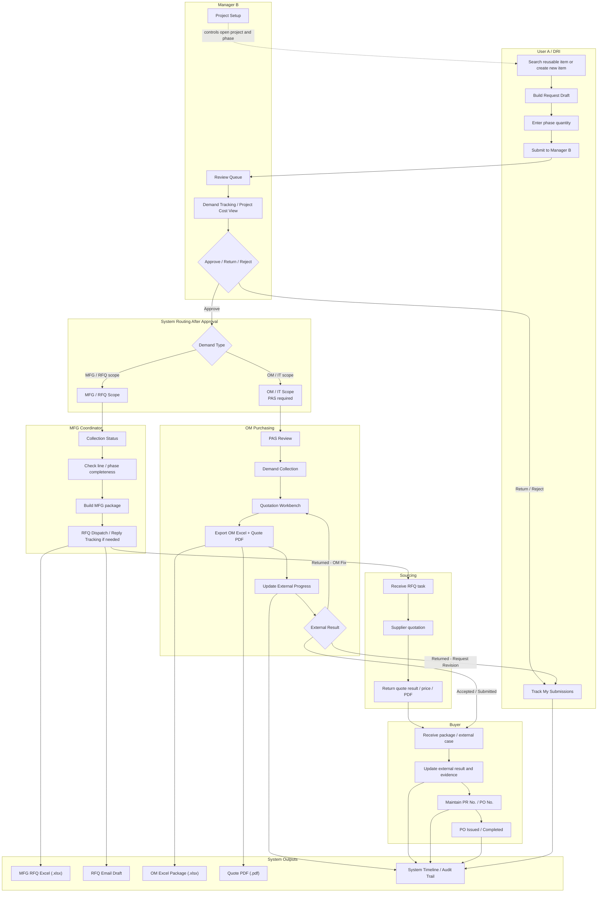

# IT System Flow and Functional Explanation

This document is the English handoff version for IT. It describes the current target workflow of the procurement prototype in a system-oriented way, including role ownership, end-to-end flow, output files, and key tracking points.

## 1. Goal

The system replaces fragmented email-based purchasing coordination with a traceable workflow for:

- demand collection
- manager approval
- PAS information handoff for OM / IT scope
- RFQ and quotation coordination
- package submission tracking
- PR / PO progress tracking
- evidence and revision history

The purpose is not only request submission, but also to build a complete audit trail from demand initiation to external purchasing completion.

## 2. Role Ownership

| Role | Main Responsibility | What the Role Updates in System |
| --- | --- | --- |
| User A / DRI | Creates and submits demand | request draft, quantity by phase, new item request, supporting reason |
| Manager B | Reviews and decides demand | approve / return / reject, manager reason, project setup |
| MFG Coordinator | Collects MFG package completeness | collection status, package readiness, RFQ dispatch tracking when needed |
| OM Purchasing | Owns OM / IT package after approval and PAS | PAS result, final spec/model, quote info, quote PDF, OM Excel package, external progress |
| Sourcing | Handles supplier quotation for RFQ-required flow | vendor, quotation result, price, quote PDF |
| Buyer | Tracks external purchasing execution | external request no., PR no., PO no., external evidence, completion status |

Important rule:

- `Purchasing` is not a separate login role in the prototype.
- `Buyer` is the execution-tracking role for downstream PR / PO status.

## 3. End-to-End Flowchart

## 4. Flow Explanation by Stage

### A. Demand Creation

User A starts from `Department Item Request`.

User A can:

- search reusable items
- copy from approved history
- create a new item draft
- enter phase quantity in request draft
- submit to Manager B

`Demand Tracking` is read-only. It is used only for review of:

- planned demand
- carryover
- need to buy
- risk

It is not a request-creation entry point.

### B. Manager Approval

Manager B works in `Review Queue`.

Manager B can:

- approve
- return with reason
- reject with reason

Manager B also uses:

- `Project Cost View` for cost visibility
- `Demand Tracking` for phase-level summary
- `Project Setup` to maintain project code, current phase, and User A access

After approval, the system routes the request to one of two main paths:

- OM / IT scope
- MFG / RFQ scope

### C. OM / IT Scope Path

OM / IT scope does not go directly to quote handling.

It first enters `PAS Review`, where OM Purchasing maintains:

- PAS status
- PAS project code
- PAS budget amount
- PAS comment

After PAS is approved, the row moves to `Demand Collection`, then to `Quotation Workbench`.

In `Quotation Workbench`, OM Purchasing maintains:

- final spec / model
- vendor
- price
- quote date
- quote expiry
- quote PDF

After quote information is ready, OM exports:

- OM Excel Package
- Quote PDF

OM then records downstream external progress with status and evidence.

### D. MFG / RFQ Scope Path

MFG demand goes to `MFG Coordinator`.

The coordinator does not own IT PAS review. The coordinator focuses on:

- line / phase completeness
- package readiness
- missing input follow-up

If supplier quotation is required, the coordinator prepares RFQ flow:

- RFQ Excel
- email draft
- reply tracking

If sourcing is involved, `Sourcing` updates:

- vendor
- quotation result
- price
- quote PDF

After package readiness is complete, the downstream handoff continues to Buyer tracking.

### E. Buyer / External Progress Path

Buyer tracks the downstream execution after package submission.

Buyer maintains:

- external request no.
- PR no.
- PO no.
- evidence
- completion status

The system does not automatically decide CFA or ECS path. That remains governed by external business rules and is tracked through returned evidence and status updates.

## 5. Output Files

| Output | Owner | Format | Purpose |
| --- | --- | --- | --- |
| MFG RFQ Excel | MFG Coordinator | `.xlsx` | RFQ package for supplier quotation |
| RFQ Email Draft | MFG Coordinator | copyable text | Email subject/body for outside communication |
| OM Excel Package | OM Purchasing | `.xlsx` | Formal OM submission package |
| Quote PDF | OM Purchasing / Sourcing | `.pdf` | Quote evidence attached to package |
| External Evidence | OM Purchasing / Buyer | screenshot / pasted text / file | Proof of submission, return, PR, PO, completion |

## 6. Core Tracking Logic

The system must keep a full timeline per request or package.

Each progress event should be traceable with:

- current status
- current owner
- reason / note
- timestamp
- external request no.
- PR no.
- PO no.
- evidence
- revision history

Typical progress statuses include:

- `Package Preparing`
- `Package Ready`
- `Submitted to External System`
- `External Review`
- `External Returned`
- `Revision In Progress`
- `PR Created`
- `PO Issued`
- `Completed`

## 7. Key IT Notes

- `Demand Tracking` is read-only and must not create request rows.
- `Project Setup` is a separate Manager tab and controls project availability and current phase.
- Manager approval is the routing gate.
- OM Purchasing and MFG Coordinator are different paths and must remain separate in ownership and UI.
- OM Purchasing owns PAS and OM package output.
- MFG Coordinator owns MFG completeness and RFQ package preparation.
- Buyer owns downstream external result, PR / PO, and completion evidence.
- All important state changes must write to in-system history instead of only changing current status.

