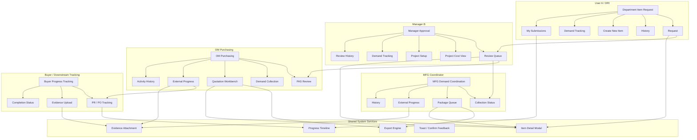

# IT System Module Map - Procurement Prototype

This document is the IT-facing module map for the current procurement prototype.  
It focuses on **system structure**, not just business flow, so the development team can see:

- which role uses which page
- which tab belongs to which module
- what each module does
- what file output each module is responsible for

## 1. System Module Diagram

## 2. Module Breakdown by Role

### User A / DRI

#### Page: Department Item Request

| Tab | Purpose | Main Actions | Output |
| --- | --- | --- | --- |
| Request | Build request draft and submit demand | add item, edit qty, submit to manager | submitted request record |
| History | Reuse approved historical items | add approved history item to request draft | draft request line |
| Create New Item | Create a new draft item when existing item is not available | create item draft | draft request line |
| Demand Tracking | Read-only view for demand reference | view detail only | no direct file output |
| My Submissions | Track submitted request status | view revision / status / timeline | no direct file output |

### Manager B

#### Page: Manager Approval

| Tab | Purpose | Main Actions | Output |
| --- | --- | --- | --- |
| Review Queue | Review submitted requests | approve, return, reject | approval decision |
| Project Cost View | View project-level cost visibility | review only | no direct file output |
| Project Setup | Maintain project master settings | save draft project, open/close to User A | project setup data |
| Demand Tracking | Review phase-level demand summary | review only | no direct file output |
| Review History | View approved / returned / rejected history | detail review | no direct file output |

### MFG Coordinator

#### Page: MFG Demand Coordination

| Tab | Purpose | Main Actions | Output |
| --- | --- | --- | --- |
| Collection Status | Check whether line / phase input is complete | monitor completeness | status update |
| Package Queue | Prepare MFG package for downstream action | export package, review detail | MFG RFQ Excel |
| External Progress | Maintain downstream status and evidence | update progress, upload evidence | progress event |
| History | Review package action history | review only | audit trail |

### OM Purchasing

#### Page: OM Purchasing

| Tab | Purpose | Main Actions | Output |
| --- | --- | --- | --- |
| PAS Review | Maintain PAS status and returned result | update PAS status | PAS review record |
| Demand Collection | Consolidate approved demand before quote work | review and group demand | demand collection data |
| Quotation Workbench | Maintain quote and export package | upload quote PDF, save quote info, export files | OM Excel Package, Quote PDF |
| External Progress | Track external submission result | update progress, upload evidence | progress event |
| Activity History | Review package and quote activity | review only | audit trail |

### Buyer / Downstream Tracking

#### Page: Buyer Progress Tracking

| Module | Purpose | Main Actions | Output |
| --- | --- | --- | --- |
| PR / PO Tracking | Track downstream purchasing execution | maintain PR No., PO No., status | PR / PO progress record |
| Evidence Upload | Attach proof from external system | upload screenshot, PDF, zip, pasted result | evidence attachment |
| Completion Status | Close downstream case | mark completed / returned | final progress status |

## 3. Shared Components

| Shared Component | Used By | Purpose |
| --- | --- | --- |
| Item Detail Modal | User A, Manager B, MFG Coordinator, OM Purchasing | show item information and timeline in one consistent place |
| Progress Timeline | User A, Manager B, MFG Coordinator, OM Purchasing, Buyer | show full end-to-end status history |
| Evidence Attachment | MFG Coordinator, OM Purchasing, Buyer | keep screenshots, PDFs, emails, pasted result, ZIP files |
| Toast / Confirm Feedback | all roles | unified interaction feedback |
| Export Engine | MFG Coordinator, OM Purchasing | generate Excel / PDF output files |

## 4. File Output Ownership

| File / Output | Owner | Source Module | Format |
| --- | --- | --- | --- |
| MFG RFQ Excel | MFG Coordinator | Package Queue | `.xlsx` |
| RFQ Email Draft | MFG Coordinator | Package Queue | copyable text |
| OM Excel Package | OM Purchasing | Quotation Workbench | `.xlsx` |
| Quote PDF | OM Purchasing / Sourcing | Quotation Workbench | `.pdf` |
| Progress Evidence | MFG Coordinator / OM Purchasing / Buyer | External Progress / Evidence Upload | screenshot / text / attachment |
| PR / PO Tracking Record | Buyer | PR / PO Tracking | in-system record |

## 5. Recommended IT Module Boundaries

For implementation, the frontend can be separated into these modules:

1. `request-module`
   - Department Item Request
   - draft building
   - submission status

2. `manager-module`
   - approval queue
   - project setup
   - cost and demand tracking

3. `mfg-coordinator-module`
   - completeness tracking
   - MFG package preparation
   - MFG external progress

4. `om-purchasing-module`
   - PAS review
   - demand collection
   - quotation workbench
   - OM external progress

5. `buyer-progress-module`
   - PR / PO progress
   - evidence upload
   - completion status

6. `shared-ui-module`
   - detail modal
   - timeline
   - toast / confirm
   - export helpers

## 6. Key Implementation Notes

- `Demand Tracking` is read-only and is not a request creation entry.
- `Project Setup` is separated from `Demand Tracking` for cleaner ownership.
- Manager approval is the main routing gate.
- MFG Coordinator and OM Purchasing have different responsibilities and should not be merged into one page.
- External progress must be event-based and evidence-based.
- Returned / revised flow must preserve full history instead of overwriting old data.
