# IT Swimlane Flow - Procurement Prototype

This version is prepared for IT and focuses on role handoff, ownership boundaries, and system outputs in a swimlane-style flow.

## Swimlane Flow

```mermaid
flowchart LR

  subgraph UA["User A / DRI"]
    UA1["Search item / reuse approved history / create new item draft"]
    UA2["Build request draft"]
    UA3["Enter phase quantity"]
    UA4["Submit request"]
    UA5["Track submission status and revision result"]
  end

  subgraph MC["MFG Coordinator"]
    MC1["Collect MFG line / phase input completeness"]
    MC2["Check package readiness"]
    MC3["Prepare MFG package"]
    MC4["Export RFQ Excel / generate email draft if quotation is needed"]
  end

  subgraph MB["Manager B"]
    MB1["Review Queue"]
    MB2["Review demand tracking / project cost / project setup"]
    MB3{"Decision"}
    MB4["Approve"]
    MB5["Return / Reject with reason"]
  end

  subgraph RT["System Routing"]
    RT1{"Approved demand type"}
    RT2["OM / IT scope"]
    RT3["MFG / RFQ scope"]
  end

  subgraph OM["OM Purchasing"]
    OM1["PAS Review"]
    OM2["Demand Collection"]
    OM3["Quotation Workbench"]
    OM4["Upload quote PDF / maintain quote info"]
    OM5["Export OM Excel package + quote PDF"]
    OM6["Submit package to external system"]
    OM7{"External result"}
  end

  subgraph SO["Sourcing"]
    SO1["Receive RFQ request"]
    SO2["Ask supplier for quotation"]
    SO3["Return quote result / price / PDF"]
  end

  subgraph BY["Buyer"]
    BY1["Receive approved package / case"]
    BY2["Update external system result"]
    BY3["Maintain PR No. / PO No."]
    BY4["Close as completed"]
  end

  subgraph OUT["Outputs / Audit Trail"]
    O1["MFG RFQ Excel (.xlsx)"]
    O2["RFQ email draft"]
    O3["OM Excel package (.xlsx)"]
    O4["Quote PDF (.pdf)"]
    O5["Progress timeline / evidence / revision history"]
  end

  UA1 --> UA2 --> UA3 --> UA4 --> MB1
  MB1 --> MB2 --> MB3
  MB3 --> MB4 --> RT1
  MB3 --> MB5 --> UA5

  RT1 --> RT2 --> OM1 --> OM2 --> OM3 --> OM4 --> OM5 --> OM6 --> OM7
  RT1 --> RT3 --> MC1 --> MC2 --> MC3 --> MC4 --> SO1 --> SO2 --> SO3 --> BY1

  OM5 --> O3
  OM5 --> O4
  MC4 --> O1
  MC4 --> O2

  OM6 --> O5
  OM7 -- "Accepted / Submitted" --> BY1
  OM7 -- "Returned - OM Fix" --> OM3
  OM7 -- "Returned - Request Revision" --> UA5

  BY1 --> BY2 --> BY3 --> BY4 --> O5
  UA5 --> O5
```

## Role Explanation

### User A / DRI

- Creates the original demand.
- Selects reusable items, copies from approved history, or creates a new item draft.
- Enters quantity by phase.
- Submits the request to Manager B.
- Tracks returned, rejected, or revised requests.

### MFG Coordinator

- Owns MFG demand completeness before downstream purchasing work starts.
- Confirms whether line / phase / area input is complete.
- Prepares the MFG package.
- If quotation is required, exports RFQ Excel and generates the email draft.

### Manager B

- Is the approval gate for submitted demand.
- Reviews quantity, cost visibility, carryover, and request reason.
- Can approve, return, or reject.
- Uses project setup, demand tracking, and project cost view as decision support.

### OM Purchasing

- Owns OM / IT scope after manager approval.
- Maintains PAS review information.
- Consolidates approved demand.
- Maintains quote information and quote PDF.
- Exports the formal OM package for downstream external submission.

### Sourcing

- Supports quotation for RFQ-required flow.
- Returns vendor quote result, price, and PDF.

### Buyer

- Tracks downstream execution after package handoff.
- Maintains external progress, PR number, PO number, and completion status.

## Output Files

| Output | Owner | Format | Purpose |
| --- | --- | --- | --- |
| MFG RFQ Excel | MFG Coordinator | `.xlsx` | RFQ package for supplier quotation |
| RFQ Email Draft | MFG Coordinator | copyable text | Email subject/body for external sending |
| OM Excel Package | OM Purchasing | `.xlsx` | Formal OM submission package |
| Quote PDF | OM Purchasing / Sourcing | `.pdf` | Quotation evidence |
| Progress Evidence | System / OM / Buyer | screenshot / text / attachment | Submission proof, returned proof, PR / PO trace |

## Key Tracking Logic

- Every request or package must have a timeline.
- Each status update should create a progress event.
- Each progress event can include evidence:
  - screenshot
  - pasted external result
  - email proof
  - PDF
  - Excel
  - ZIP or other package file
- Returned and revised cases must not overwrite previous history.

## Suggested Status Chain

The practical status chain for IT implementation is:

1. Draft
2. Submitted
3. Manager Review
4. Approved / Returned / Rejected
5. PAS Review or MFG Package Preparation
6. Quote / Package Preparation
7. Submitted to External System
8. External Returned or PR Created
9. PO Issued
10. Completed
