# 05 Cross-Role Flow

## Main Flow

```mermaid
flowchart LR
  A["Requester<br/>Request Workspace"] --> B["Save Draft<br/>Need Date optional"]
  B --> C["Submit active worksheet<br/>Need Date required"]
  C --> D["Dept DRI<br/>Submission Review"]
  D -->|"Approve"| E["Cost Manager<br/>Final Authorization"]
  D -->|"Reject"| R["Requester<br/>Action Required"]
  E -->|"Authorize"| F["OM Leader<br/>Intake / Assignment"]
  E -->|"Reject"| R
  F --> G["OM Purchasing<br/>PAS Demand No"]
  G --> H["OM Purchasing<br/>PAS Quote Result"]
  H --> I["System Price Decision<br/>USD delta threshold"]
  I -->|"Delta <= 0.40"| J["Auto Cleared"]
  I -->|"Delta > 0.40 / no history / new item / Temporary Budget"| K["Dept DRI<br/>Price Exception Review"]
  K -->|"Approve"| L["Budget Approver<br/>Final Budget Approval"]
  K -->|"Reject"| R
  L -->|"Approve"| M["OM Export Package"]
  L -->|"Reject"| R
  J --> M
  M --> N["Mark Exported"]
  N --> O["Buyer Handoff<br/>PR / PO ownership"]
```

## State Transition

| From | Action | To | Owner |
| --- | --- | --- | --- |
| Draft | Save Draft | Draft | Requester |
| Draft | Submit active worksheet | Dept DRI Review | Requester / System |
| Dept DRI Review | Approve | Cost Manager Review | Dept DRI |
| Dept DRI Review | Reject | Requester Action Required | Dept DRI |
| Cost Manager Review | Authorize | OM Intake / Assignment | Cost Manager |
| Cost Manager Review | Reject | Requester Action Required | Cost Manager |
| OM Intake / Assignment | Assign / auto-assign | PAS Demand No | OM Leader / System |
| PAS Demand No | Save PAS Demand No | PAS Quote Result | OM Purchasing |
| PAS Quote Result | Save Quote Info | Price Decision | OM Purchasing / System |
| Price Decision | Auto Clear | OM Export Package | System |
| Price Decision | Exception Required | Dept DRI Price Exception Review | System |
| Dept DRI Price Exception Review | Approve | Budget Approver Review | Dept DRI |
| Dept DRI Price Exception Review | Reject | Requester Action Required | Dept DRI |
| Budget Approver Review | Final Approve | OM Export Package | Budget Approver |
| Budget Approver Review | Reject | Requester Action Required | Budget Approver |
| OM Export Package | Mark Exported | Buyer Handoff | OM Purchasing |

## Visibility Rules

- After Requester submit, Dept DRI queue can see the row; Requester `Request Status` shows the pending owner.
- After Dept DRI approve, Cost Manager `Cost Review` can see the row; Dept DRI evidence keeps the row and shows it was sent to the next owner.
- After Cost Manager authorize, OM Leader intake / assignment can see the row; OM Purchasing sees assigned rows only.
- After OM saves quote info, the system applies the absolute USD delta rule:
  - `quoteUnitPriceUsd - historyUnitPriceUsd <= 0.40`: Auto Cleared.
  - `> 0.40`, no history price, new item, or Temporary Budget: Dept DRI -> Budget Approver.
- After Budget Approver approve, the row can enter OM Export Package.
- After OM marks exported, the row enters `Buyer Handoff`; user-facing UI must not use vague legacy post-export wording as the primary label.

## Reject / Cancel Rules

- Reject must always preserve reason, timestamp, actor, previous stage, and next owner.
- Dept DRI reject -> Requester Action Required -> revise / resubmit -> Dept DRI.
- Cost Manager reject -> Requester Action Required -> revise / resubmit -> Dept DRI.
- Budget Approver reject -> Requester Action Required.
- OM reject routes to Requester Action Required or Dept DRI review depending on reason.
- Rejected / Cancelled rows stay in timeline/detail and are excluded from active cost/effective demand calculations.

## Warehouse / Carryover Flow

- Warehouse stock is evidence, not an immediate cost deduction.
- Requester can create inventory use candidates; only the matching OM / MFG / Unit owner lock affects effective cost.
- Carryover is represented by ledger events and does not overwrite original demand.
- Unit-owned warehouse / carryover candidates are reviewed by Dept DRI / Unit owner.
- Cost Manager consumes effective quantity / cost evidence only after locked/applied ledger state.

## Currency Rule

- Cost and price calculations use USD canonical fields.
- VND display, input, and export values are converted through exchange rates maintained by OM Leader / Admin.
