# 05 跨角色流程

## 主流程

```mermaid
flowchart LR
  A["Requester<br/>Request Workspace"] --> B["Save Draft<br/>Need Date optional"]
  B --> C["Submit active worksheet<br/>Need Date required"]
  C --> D["Dept DRI<br/>Submission Review"]
  D -->|"Approve"| E["Cost Manager<br/>Final Authorization"]
  D -->|"Reject"| R["Requester<br/>Action Required"]
  E -->|"Authorize"| F["OM Leader<br/>Intake / Assignment"]
  E -->|"Reject"| R
  F --> G["OM Purchasing<br/>PAS Demand No"]
  G --> H["OM Purchasing<br/>PAS Quote Result"]
  H --> I["System Price Decision<br/>USD delta threshold"]
  I -->|"Delta <= 0.40"| J["Auto Cleared"]
  I -->|"Delta > 0.40 / no history / new item / Temporary Budget"| K["Dept DRI<br/>Price Exception Review"]
  K -->|"Approve"| L["Budget Approver<br/>Final Budget Approval"]
  K -->|"Reject"| R
  L -->|"Approve"| M["OM Export Package"]
  L -->|"Reject"| R
  J --> M
  M --> N["Mark Exported"]
  N --> O["Buyer Handoff<br/>PR / PO ownership"]
```

## 狀態轉移

| From | Action | To | Owner |
| --- | --- | --- | --- |
| Draft | Save Draft | Draft | Requester |
| Draft | Submit active worksheet | Dept DRI Review | Requester / System |
| Dept DRI Review | Approve | Cost Manager Review | Dept DRI |
| Dept DRI Review | Reject | Requester Action Required | Dept DRI |
| Cost Manager Review | Authorize | OM Intake / Assignment | Cost Manager |
| Cost Manager Review | Reject | Requester Action Required | Cost Manager |
| OM Intake / Assignment | Assign / auto-assign | PAS Demand No | OM Leader / System |
| PAS Demand No | Save PAS Demand No | PAS Quote Result | OM Purchasing |
| PAS Quote Result | Save Quote Info | Price Decision | OM Purchasing / System |
| Price Decision | Auto Clear | OM Export Package | System |
| Price Decision | Exception Required | Dept DRI Price Exception Review | System |
| Dept DRI Price Exception Review | Approve | Budget Approver Review | Dept DRI |
| Dept DRI Price Exception Review | Reject | Requester Action Required | Dept DRI |
| Budget Approver Review | Final Approve | OM Export Package | Budget Approver |
| Budget Approver Review | Reject | Requester Action Required | Budget Approver |
| OM Export Package | Mark Exported | Buyer Handoff | OM Purchasing |

## 即時可見規則

- Requester submit 後，Dept DRI queue 可見；Requester `Request Status` 顯示 pending owner。
- Dept DRI approve 後，Cost Manager `Cost Review` 可見；Dept DRI evidence 保留該 row 並顯示已送下一站。
- Cost Manager authorize 後，OM Leader intake / assignment 可見；OM Purchasing 只能看 assigned rows。
- OM save quote info 後，系統使用 USD 絕對價差判斷：
  - `quoteUnitPriceUsd - historyUnitPriceUsd <= 0.40`：Auto Cleared。
  - `> 0.40`、無 history price、新品項或 Temporary Budget：進 Dept DRI -> Budget Approver。
- Budget Approver approve 後，row 才可進 OM Export Package。
- OM mark exported 後，狀態進 `Buyer Handoff`；使用者介面不可再用模糊的舊版 post-export 文案作主稱呼。

## Reject / Cancel 規則

- Reject 永遠要保留 reason、timestamp、actor、previous stage、next owner。
- Dept DRI reject -> Requester Action Required -> revise / resubmit -> Dept DRI。
- Cost Manager reject -> Requester Action Required -> revise / resubmit -> Dept DRI。
- Budget Approver reject -> Requester Action Required。
- OM reject 依原因回 Requester Action Required 或 Dept DRI review。
- Rejected / Cancelled 保留在 timeline/detail，不進 active cost/effective demand 計算。

## Warehouse / Carryover Flow

- Warehouse stock 是 evidence，不是直接扣成本。
- Requester 可建立 inventory use candidate；對應 OM / MFG / Unit owner lock 後才影響 effective cost。
- Carryover 以 ledger event 表示，不覆蓋 original demand。
- Unit-owned warehouse / carryover candidate 由 Dept DRI / Unit owner review。
- Cost Manager 只消費 locked/applied 後的 effective quantity / cost evidence。

## Currency Rule

- 成本與價格計算以 USD canonical fields 為準。
- VND 顯示、輸入與 export 透過 OM Leader / Admin 維護的匯率換算。
