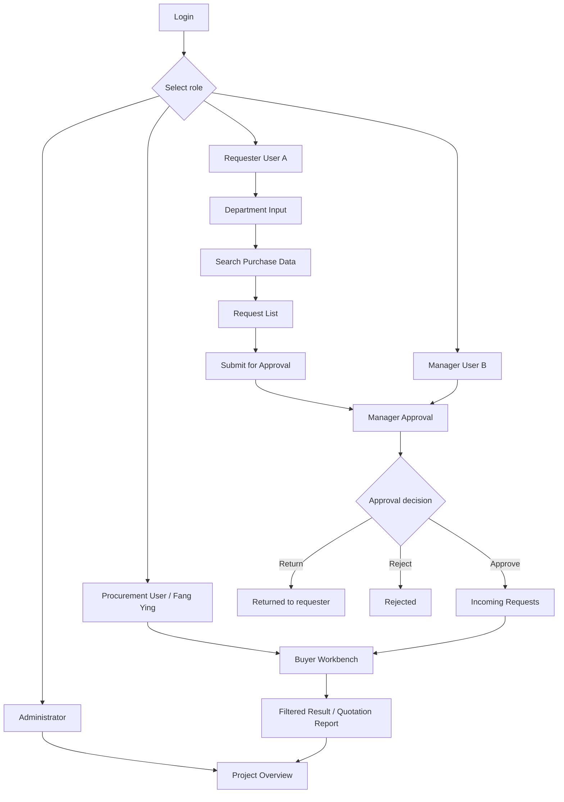
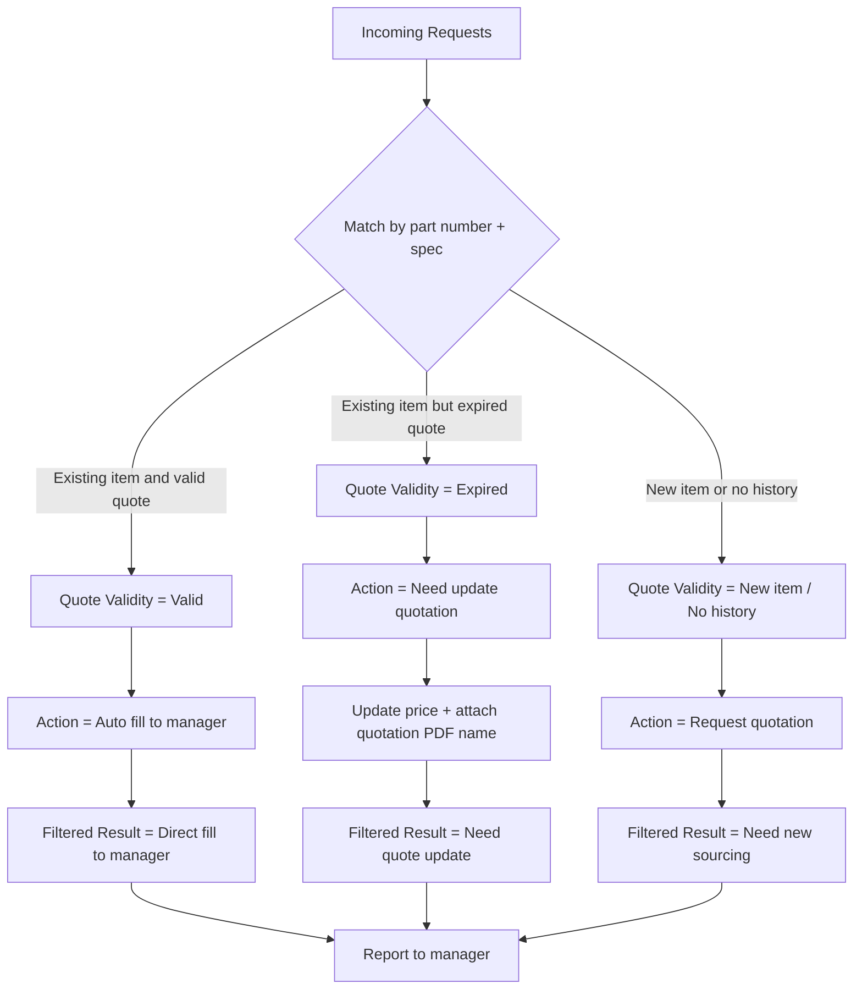
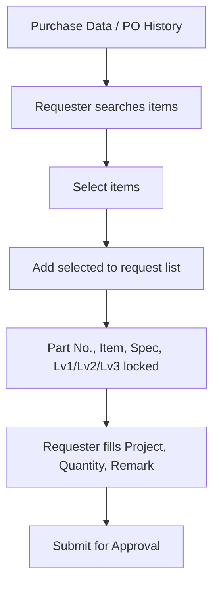

# Procurement System Flow

Updated: 2026-04-25

## Role Flow

```mermaid
flowchart TD
  Login["Login"] --> Role{"Select role"}
  Role --> Requester["Requester User A"]
  Role --> Manager["Manager User B"]
  Role --> Procurement["Procurement User / Fang Ying"]
  Role --> Admin["Administrator"]

  Requester --> DeptInput["Department Input"]
  DeptInput --> SearchData["Search Purchase Data"]
  SearchData --> RequestList["Request List"]
  RequestList --> Submit["Submit for Approval"]
  Submit --> Approval["Manager Approval"]

  Manager --> Approval
  Approval --> Decision{"Approval decision"}
  Decision -->|Approve| Incoming["Incoming Requests"]
  Decision -->|Return| Returned["Returned to requester"]
  Decision -->|Reject| Rejected["Rejected"]

  Procurement --> BuyerWorkbench["Buyer Workbench"]
  Incoming --> BuyerWorkbench
  BuyerWorkbench --> Report["Filtered Result / Quotation Report"]

  Admin --> Overview["Project Overview"]
  Report --> Overview
```

## Buyer Workbench Flow

```mermaid
flowchart TD
  Incoming["Incoming Requests"] --> Match{"Match by part number + spec"}

  Match -->|Existing item and valid quote| Valid["Quote Validity = Valid"]
  Match -->|Existing item but expired quote| Expired["Quote Validity = Expired"]
  Match -->|New item or no history| NewItem["Quote Validity = New item / No history"]

  Valid --> AutoFill["Action = Auto fill to manager"]
  AutoFill --> Direct["Filtered Result = Direct fill to manager"]

  Expired --> NeedUpdate["Action = Need update quotation"]
  NeedUpdate --> UpdatePrice["Update price + attach quotation PDF name"]
  UpdatePrice --> QuoteUpdate["Filtered Result = Need quote update"]

  NewItem --> RequestQuote["Action = Request quotation"]
  RequestQuote --> NewSourcing["Filtered Result = Need new sourcing"]

  Direct --> ManagerReport["Report to manager"]
  QuoteUpdate --> ManagerReport
  NewSourcing --> ManagerReport
```

## Purchase Data to Requester Flow

```mermaid
flowchart TD
  PurchaseData["Purchase Data / PO History"] --> UserSearch["Requester searches items"]
  UserSearch --> SelectItems["Select items"]
  SelectItems --> AddList["Add selected to request list"]
  AddList --> LockedFields["Part No., Item, Spec, Lv1/Lv2/Lv3 locked"]
  LockedFields --> FillFields["Requester fills Project, Quantity, Remark"]
  FillFields --> Submit["Submit for Approval"]
```

